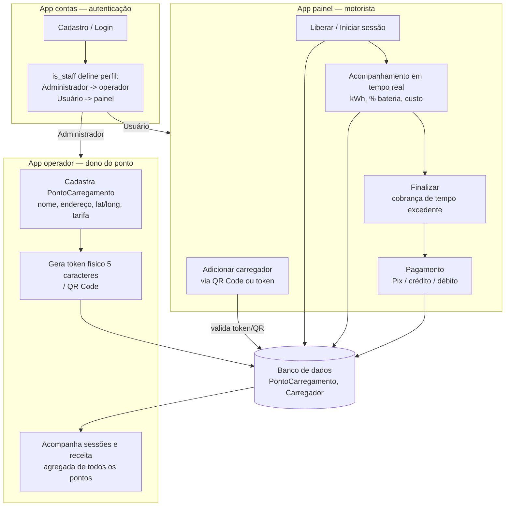

# WeCharge — Sprint 3: Prototipagem Funcional e Integração

Entrega válida para as disciplinas **Pensamento Computacional e Automação
com Python** e **Soluções em Energias Renováveis e Sustentáveis**
(GoodWe EV Challenge 2026 — FIAP).

## 1. Equipe

| Nome    | RM     |
|---------|--------|
| Victor  | 571483 |
| Miguel  | 568873 |
| Isabela | 569196 |
| Gustavo | 569287 |
| Artur   | 570880 |

## 2. Esquema de integração dos componentes

O protótipo é um sistema web único (Django) que simula, de ponta a
ponta, o ciclo de uma sessão de recarga de veículo elétrico — do
cadastro do ponto físico pelo operador até o pagamento pelo motorista.

- **`contas`** cuida de cadastro/login e decide, pelo campo `is_staff`,
  se a pessoa é motorista (`painel`) ou dona de ponto (`operador`).
- **`operador`** cadastra o ponto físico (`PontoCarregamento`): nome,
  endereço, posição no mapa (Leaflet), tarifa por kWh, e gera o token
  de 5 caracteres/QR Code que fica associado a esse ponto no banco.
- **`painel`** é onde o motorista usa o token/QR para abrir uma sessão
  de carga (`Carregador`), acompanha em tempo real e paga ao final.
- Todos os apps leem e gravam no mesmo banco (SQLite), o que garante
  que o preço mostrado ao operador e o cobrado do motorista sejam
  sempre o mesmo dado.

## 3. Justificativa técnica das escolhas

- **Django (em vez de manter o protótipo Flask separado)**: o time
  tinha dois protótipos distintos — um em Flask (fluxo do carregador)
  e um em Django (cadastro/login/paineis). Rodar dois servidores
  trocando sessão entre eles seria frágil, então toda a lógica do
  Flask foi portada para dentro do app `painel` do Django. Resultado:
  um único servidor, uma única sessão de usuário, um único banco.
- **Modelo relacional (`ForeignKey`) em vez de dicionário em memória**:
  a versão inicial do Flask guardava os carregadores num dicionário
  Python (`CHARGERS = {}`), que se perdia a cada reinício do servidor
  e não distinguia usuários. Trocado por modelos Django
  (`PontoCarregamento`, `Carregador`) salvos no banco, cada um ligado
  ao dono/usuário certo — o que permite isolamento real entre contas.
- **Token físico de 5 caracteres + QR Code**: simula a etiqueta que
  ficaria colada no carregador real do GoodWe Challenge, permitindo
  testar tanto a leitura por câmera quanto a digitação manual.
- **Cálculo de energia parametrizado**: potência do carregador (7,4 kW,
  padrão de wallbox monofásica AC), tarifa (R$0,79/kWh, tarifa
  residencial convencional) e capacidade de bateria (40 kWh) ficam
  centralizados no topo de `painel/models.py` — fácil de trocar pelos
  valores reais do hardware do GoodWe quando disponíveis, sem mexer na
  lógica de cálculo.
- **Preço travado por sessão**: o preço por kWh é copiado para a sessão
  no momento em que ela é criada, então uma alteração de tarifa feita
  pelo operador depois não muda uma cobrança já em andamento — decisão
  de integridade dos dados financeiros da simulação.
- **CSRF real e isolamento por usuário testados**: toda chamada que
  altera dados exige o cabeçalho `X-CSRFToken`, e toda consulta filtra
  por `usuario=request.user`, testado com o test client do Django
  (usuário A não acessa carregador de usuário B).

## 4. Resultados e dados funcionais apresentados

- Fluxo completo testado de ponta a ponta: cadastro → login →
  cadastro de ponto pelo operador → leitura do token pelo motorista →
  liberar → iniciar → acompanhamento em tempo real (kWh, % bateria,
  custo) → cobrança de tempo excedente quando aplicável → tela de
  pagamento → confirmação.
- Painel do operador mostra dados agregados reais (não mais valores
  fixos de exemplo): sessões em uso, energia vendida, receita e lucro
  estimado por ponto pertencente à conta.
- Histórico de sessões concluídas fica salvo por usuário
  (`painel/historico.html`), com valor final pago.
- 
- 
- 

## 5. Conexão com os conteúdos da disciplina

- **Pensamento Computacional e Automação com Python**: modelagem do
  problema em entidades e regras (`PontoCarregamento`, `Carregador`,
  estados de uma sessão), automação do fluxo de decisão (geração de
  token, cálculo automático de energia/custo, liberação condicionada à
  disponibilidade do ponto) e lógica condicional aplicada a um processo
  do mundo real.
- **Soluções em Energias Renováveis e Sustentáveis**: simulação de
  gestão de recarga de veículos elétricos com dados de mercado
  (potência de carregador AC, tarifa de energia, capacidade de bateria
  de VE popular), mostrando como automação e coleta de dados de consumo
  contribuem para uso mais eficiente e rastreável da energia entregue a
  cada sessão de carga.

---
*Histórico técnico completo de como o projeto foi integrado está em
`REGISTRO_INTEGRACAO.md`, na raiz do repositório.*
